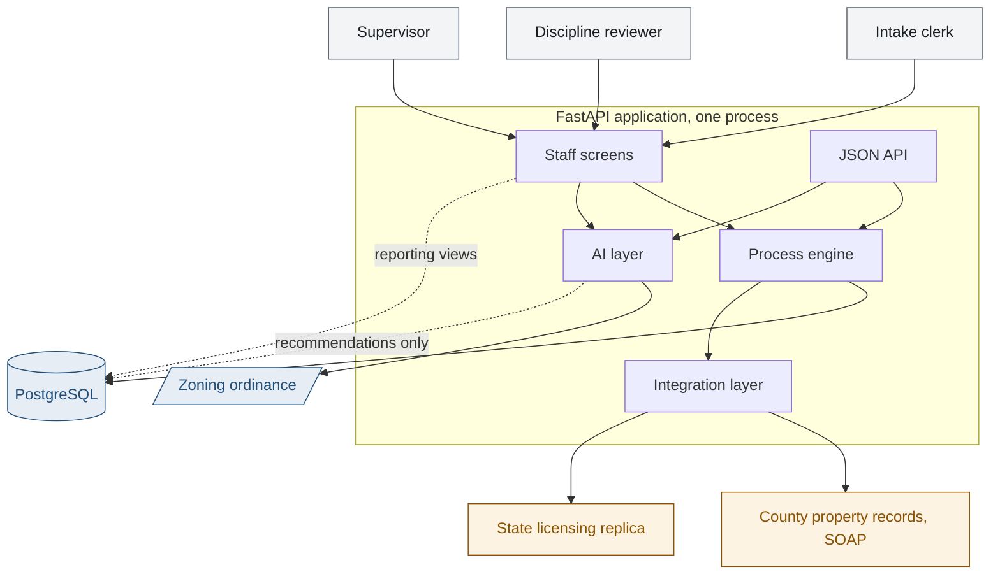
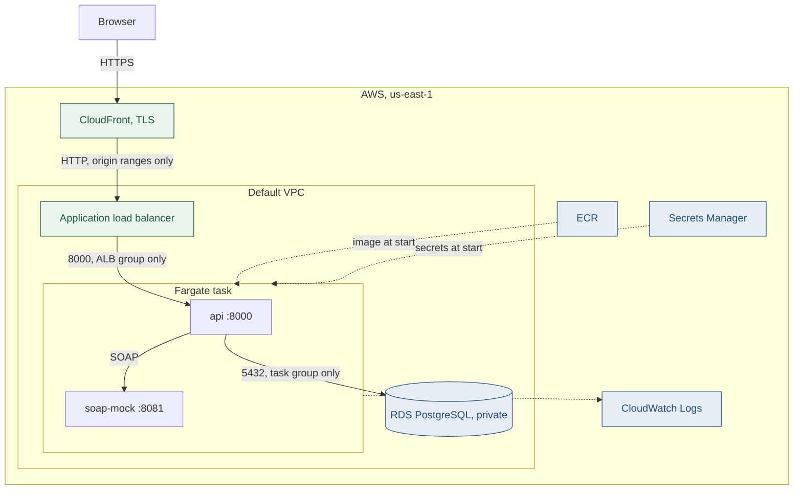

# PermitFlow

A building permit review system for a municipal permitting department. It handles the part
of the job that spreadsheets are bad at: a case that moves through eight states, gets
reviewed by four specialists working in parallel, stops and starts a clock that only counts
business days, pulls data from two systems nobody in the department controls, and has to be
reconstructable line by line when a decision gets appealed two years later.

**Live: https://d2z5bkq0t31r0m.cloudfront.net** behind one shared passphrase.

The client is the City of Rivermont, which does not exist. The zoning provisions, fee
thresholds, and review timelines are modeled on patterns common to mid-size US
municipalities. The engineering problems are real.

Three things worth stating plainly. The repository was initialized after the code was
written, so the commits are sequenced to follow the build order in
[docs/05-user-stories.md](docs/05-user-stories.md) and not a real calendar. No part of this
has ever run in a municipal department, and every number below comes from the seeded case
generator. And the sign-in on the deployed copy is a gate on a public address, not the
city's single sign-on; the page says so.

## Why this exists

Most of the code I write moves data from one shape to another. This is a different problem.
The hard part is not any single operation, it is that the state of a permit application is
the product of a dozen rules that interact, and every one of them has a way of being quietly
wrong.

A few examples of what that looks like in practice:

- The department reports its cycle time to the city council. If the clock counts the three
  weeks an applicant spent redrawing a site plan, the number the council sees is wrong and
  nobody notices, because it looks reasonable.
- If a structural reviewer finds a problem, the applicant fixes it and resubmits. The zoning
  reviewer who already approved should not review it again. Getting that wrong wastes review
  capacity the department does not have.
- The county assessor's system goes down. If that stops Rivermont accepting permit
  applications, the department has converted somebody else's outage into its own service
  failure, and the front desk takes the calls.

## What it does

Intake through issuance, for department staff.

An applicant's submission is screened by a clerk, checked against the county's parcel
records and the state's contractor licensing, and either returned as incomplete or accepted.
Acceptance opens a review task per discipline, and those run in parallel with their own
assignee, their own clock, and their own round counter. Any discipline can send the case
back; the ones that already approved do not review it again. A supervisor issues or denies.

Six screens: a reviewer's queue, the case record, intake triage, ordinance questions, a
supervisor dashboard, and configuration. There is a JSON API behind them at `/docs`.

The requirements this was built against, and the process it implements, are written up in
[docs/01-requirements.md](docs/01-requirements.md) and
[docs/02-process-map.md](docs/02-process-map.md). Every requirement is traced to a module
and a named test in [docs/06-traceability.md](docs/06-traceability.md).

## How it fits together



The engine is the only thing that moves a case. Both the screens and the API call it, and
neither writes a status column. The AI layer has no path that changes a status: it writes
recommendations and reads the corpus, and a named human accepts or overrides. The screens
read the reporting views directly for anything they only display, because the compliance
number goes to city council and recomputing it in Python next to the SQL that already
computes it is how two versions of one number start to disagree.

`permitflow/process/` is where the interesting logic is. `states.py` holds the transition
table with no database access in it at all, so it can be read and argued about in a client
workshop. `engine.py` is the only thing that moves a case, and it owns three guarantees:
nothing transitions that the state machine and the actor's role do not both permit, the
denormalized status and the history row are written in one transaction, and the SLA clock
pauses as a consequence of the target state, not as something each action remembers to do.

That last one is worth dwelling on. An action that forgets to pause the clock produces a
wrong compliance number, so no action is trusted to remember.

## What is deployed



Each hop accepts traffic only from the hop above it, and the database security group has no
CIDR rule at all. [docs/07-architecture.md](docs/07-architecture.md) has both diagrams with
the reasoning, and [deploy/aws/README.md](deploy/aws/README.md) has the cost and the
teardown.

## Data model

24 tables and 8 reporting views. [docs/03-data-model.md](docs/03-data-model.md) has the ERD
and the choices worth arguing about; the two that matter most are in
[Decisions](#decisions-i-would-defend-in-a-review) below.

The reporting views are where the arithmetic lives. Compliance by month against each permit
type's council standard, cycle time split into gross, net, and applicant wait, per-reviewer
workload, per-discipline bottleneck, open escalations. The screens read those views and
recompute nothing, because the compliance figure goes to city council and a number
recalculated next to the SQL that already computes it is a number that will eventually
disagree with itself.

Business day arithmetic is a SQL function and a Python function. Two copies of one rule is a
real risk, so `tests/test_sla_parity.py` runs both over generated date pairs spanning
weekends, holidays, and the turn of the year, and fails if they ever differ.

## Decisions I would defend in a review

**Review tasks are rows, not columns.** The shortcut is four booleans on the application:
`zoning_approved`, `structural_approved`, and so on. It does not survive the requirements.
An assignee per discipline, an SLA clock per discipline, a round counter per discipline, and
reassignment history per discipline are all attributes of the review, so the review is an
entity. Adding a fifth discipline is then two rows of configuration and no schema change.

**The audit log is append-only in the database, not in the application.** A convention the
application follows is a convention the next developer breaks. Triggers that raise
`insufficient_privilege` on UPDATE, DELETE, and TRUNCATE cannot be broken by application
code at all. The test suite has to disable them as the table owner just to reset between
tests, which is the clearest demonstration I could give that the application role never can.

**The integration log has no foreign key, on purpose.** It is written on a separate
autocommit connection so an attempt log survives the rollback of the transaction that made
the call. A foreign key would make that write take a lock on the application row that
conflicts with the `FOR UPDATE` the calling transaction already holds. One side waits in
Postgres, the other in application code, and Postgres never sees a cycle to break. I found
this by hanging the API for two minutes and reading a thread dump.

**Business day math exists twice and a test forces it to agree.** The engine needs it in
Python, the reporting views need it in SQL. Two copies of one rule is a real risk, and the
failure is quiet: the engine would stamp a due date the compliance report disagrees with.
`tests/test_sla_parity.py` runs both implementations over generated date pairs spanning
weekends, holidays, and the turn of the year, and fails if they ever differ.

**"Could not check" is a different answer from "checked and it passed."** When the licensing
replica is unreachable, the contractor's licence is recorded as UNVERIFIED, never ACTIVE.
Collapsing the two is how a database outage quietly waves a revoked licence through intake,
and it is the kind of defect that only surfaces during an appeal.

## Integrations

Neither external system belongs to Rivermont, and neither has a modern interface. That is
the ordinary condition of public sector integration work, so the design accommodates it
and does not fight it.

| System | Protocol | Notes |
|---|---|---|
| County property records | SOAP 1.1 over HTTP | A real zeep client against a published WSDL. The mock service speaks the same contract, so pointing at the county is one environment variable. |
| State contractor licensing | Direct database connection | No API exists. Jurisdictions get a read only account against a replica. Hand-written SQL against a schema Rivermont does not own, with `char(12)` padding and a status column that lags the expiry date. |

Both go through one resilience policy: bounded retry with exponential backoff, a circuit
breaker so a sustained outage stops costing every applicant three timeouts, and an
attempt-level log so an integration dispute is settled with records and not with
recollection. A definitive answer, such as a parcel that genuinely does not exist, is not
retried, because retrying a definitive answer is three times the latency for the same
result.

Every failure path has a test. A resilience policy you cannot demonstrate failing is a
resilience policy nobody should believe.

## What the AI does, and what it is not allowed to do

Two features, both narrow on purpose, because the department's tolerance for an incorrect
automated decision is effectively zero.

**Intake triage** reads the applicant's scope of work narrative and drafts the structured
fields a clerk would otherwise retype. Every field carries a confidence and the verbatim
span of the narrative it came from. A field below the threshold is presented blank rather
than as a guess, because a blank costs the clerk twenty seconds and a confidently wrong
value gets accepted at a glance and becomes the record.

**Ordinance questions** get answered with the ordinance's own words. The retrieval is
lexical BM25 over the zoning code, which is the right default for a legal corpus: a reviewer
asking about "rear setback in R-90" wants the section that literally says those words.

The design decision that matters is in how a citation is produced. The model never types a
quote. Retrieval returns a section number, code reads the text back out of the corpus by
that number, and a verification pass asserts the quote appears byte for byte in the source
before the answer is returned. A model that searches, quotes, and then grades its own quote
agrees with itself. Retrieval and provenance are things a database does correctly, so they
stay in code. Judgement is the only part worth a model.

Grounding is checked by how much of the question's information content a section actually
contains, weighted by inverse document frequency. Plain term overlap is not enough, and the
failure is easy to reproduce: "how many parking spaces does a helipad require" overlaps the
residential parking section on "parking" and "spaces" and looks well supported, even though
the ordinance says nothing about helipads. Weighting by rarity fixes it, and the question
comes back unanswerable, which is the correct outcome.

Everything the AI produces is a recommendation that a named human accepts or overrides, and
both the recommendation and the decision are written to the audit log with the model and
prompt version. There is no endpoint in the AI layer that changes an application's status.

It runs with no credentials by default. The offline provider is rule-based, deterministic,
and genuinely useful, not a stub, which is what lets CI test the AI behaviour at all.
A hosted Claude path is available when a key is configured.

## Configuration, and what a department can change without a developer

The handover question is what happens when the consultant leaves. Four things are rows in
reference tables, editable by a supervisor at `/ui/admin`, and they behave differently on
purpose:

| Change | Reaches |
|---|---|
| A new review discipline | New applications only |
| A phase SLA allowance | Tasks opened afterwards |
| A required document | New applications, and open ones at their next resubmission |
| A council standard | Everything ever decided |

Routing is decided when intake is accepted, so opening a discipline on a case whose reviewers
have already signed off would rewrite a decision made under the old rules. An allowance is
written onto the task when it opens, so a supervisor cannot make a reviewer late by editing
configuration underneath them. The document checklist is rebuilt whenever a case arrives or
comes back, so a new requirement catches work still in flight, and a document already
received is never reset.

The council standard is the awkward one. The compliance view applies the current standard to
every case ever decided, so moving it rewrites what the department has already reported. The
screen refuses to do that quietly: a change that reclassifies decided cases needs a second
click, the confirmation shows how many cases change side and what the rate moves from and to,
and the audit row carries both figures.

## Security

**Authorization is in the engine.** Every action is checked against the actor's role in
`permitflow/process/states.py` before the engine will perform it, so a rule cannot be skipped
by driving the engine from a script. The API and the screens check a few things at their own
boundary as well, and those are the endpoints whose shape is role-specific, like a reviewer's
own queue.

**The audit trail is append-only in the database.** Triggers raise `insufficient_privilege`
on UPDATE, DELETE, and TRUNCATE. The test fixtures have to disable them as the table owner
just to reset between tests, which is the clearest demonstration available that the
application role never can.

**Identity is the honest gap.** `X-Actor` on the API and the user picker on the screens name
an actor without proving anything. That is correct for a laptop and wrong for a public URL,
so the deployment adds one shared passphrase with a signed, expiring, httponly cookie. It is
a gate, not a directory, and `permitflow/ui/gate.py` says so at the top. A real deployment
puts the city's SSO in front of this and resolves the actor from a validated token.

**Nothing here needs a credential to run.** The AI provider defaults to a deterministic
offline implementation and the integrations default to local stand-ins, which is what lets
CI test the whole thing with no secrets.

## Running it locally

Docker is the only prerequisite. Nothing needs an API key or an account.

```bash
docker compose up -d
python -m venv .venv && .venv/bin/pip install -r requirements-dev.txt
```

That starts two databases: PermitFlow's own, and a separate one standing in for the state
licensing replica. The schema, views, and reference data load automatically.

Start the mock county SOAP service and the application:

```bash
.venv/bin/uvicorn permitflow.integrations.soap_mock.server:app --port 8081
```

```bash
PYTHONPATH=. .venv/bin/uvicorn permitflow.api.main:app --reload --port 8000
```

Build the demo database. One command, and running it again reproduces the same database down
to the application numbers:

```bash
PYTHONPATH=.:scripts .venv/bin/python scripts/seed_demo.py
```

It clears any existing case data, generates a year of history, and adds six cases parked in
the states worth looking at: one issued with a clean review, one under review with four
disciplines open, one returned to the applicant with the clock paused, one four months old
and past its allowance, one where the licensing replica was unreachable at intake, and one
whose narrative is vague enough that three fields come back below the confidence threshold.
It prints their application numbers at the end.

Then open `http://localhost:8000/ui/` for the screens, or `/docs` for the API.

Everything is driven through the engine with an injected clock, not written as rows, so the
history obeys the same guards and writes the same audit trail as live traffic. The history is
worked backwards from the run date, so the newest cases are days old; pass `--today` to pin
it and get the same database on any machine on any day. Nothing is carried past the run date,
which is why the recent edge of the history is genuinely in flight.

Check it before demoing:

```bash
PYTHONPATH=. .venv/bin/python scripts/verify_demo.py
```

30 checks, each named for the screen it protects, non-zero exit if any fail. The one worth
reading is the SLA identity: gross minus applicant wait equals net, asserted on every decided
case and not on the averages, because an average can hold while individual rows are wrong.

`scripts/reset_demo.py` clears case data without seeding. Reference data is never touched by
either, apart from the restores that put configuration back where the seed left it.

## Testing and CI

```bash
PYTHONPATH=. .venv/bin/python -m pytest        # 368 tests
cd licensing-verifier && ./mvnw -B test        # 20 tests
```

Against a real Postgres, both of them. The database behaviour matters too much to fake: the
business day functions, the append-only triggers, the partial unique indexes, and the
reporting views are all things a substitute would let me get wrong. The Java repository test
runs against the licensing replica for the same reason, since `char(12)` padding and an
unconstrained status column are the behaviour under test.

CI runs three jobs on every push: the Python suite with both databases as service containers,
the Java suite, and a compose file check. The whole thing runs with no model credentials,
because the offline AI provider is deterministic and the tests assert on behaviour.

## Deployment

One Fargate task behind a load balancer, CloudFront in front for HTTPS, and a small managed
Postgres nothing on the internet can open a connection to. About $38 a month while it is up.

```bash
./deploy/aws/refresh.sh     # build, push, roll the service
./deploy/aws/teardown.sh    # remove everything that bills
```

[deploy/aws/README.md](deploy/aws/README.md) has the cost breakdown, what each hop can reach,
and the things it deliberately does not do, each with the reason.

## Documentation

The `docs/` directory holds the consulting side of the work, written the way it would be for
an actual engagement:

| Document | What it covers |
|---|---|
| [01-requirements.md](docs/01-requirements.md) | Business context, current state, discovery pain points, numbered functional and non-functional requirements |
| [02-process-map.md](docs/02-process-map.md) | Lifecycle and task state machines, swimlane view, where the AI sits, escalation timing |
| [03-data-model.md](docs/03-data-model.md) | ERD, the design decisions worth defending, key tables, reporting views |
| [04-integration-spec.md](docs/04-integration-spec.md) | Both external contracts, failure handling, intake sequence |
| [05-user-stories.md](docs/05-user-stories.md) | Stories by sprint, with acceptance criteria written so they read as test cases |
| [06-traceability.md](docs/06-traceability.md) | Every requirement traced to a design artifact, a module, and a test |
| [07-architecture.md](docs/07-architecture.md) | Both diagrams, the security boundary, and what is not in the picture |
| [case-study.md](docs/case-study.md) | The engagement written up for a reader who will not open the code |

The traceability matrix is checked, not asserted. Every module path and test name in it was
verified to exist.

## Layout

```
permitflow/
  process/          states, engine, SLA clock, assignment, checklist, routing, escalation
  integrations/     SOAP client, licensing client, shared resilience policy, mock service
  ai/               retrieval, grounded answers, triage, provider abstraction, recording
  api/              FastAPI routes, schemas, actor resolution, error mapping
  ui/               staff screens, Jinja templates, one stylesheet, the deployment gate
  db.py audit.py config.py errors.py demo.py
sql/                schema, reporting views, reference data, legacy licensing schema
corpus/             the zoning ordinance the retrieval layer reads
deploy/aws/         container, task definition, refresh and teardown, cost
docs/               requirements through architecture
scripts/            seeding, reset, demo verification, deployment init
tests/              368 tests against a real database
licensing-verifier/ the Spring service, with its own suite
```

## Scope and limitations

Phase 1 is intake through issuance. Inspections, certificate of occupancy, fee calculation
and payment, the public applicant portal, and appeals hearing management are all out of scope
and listed as such in the requirements.

`licensing-verifier/`, the Spring service, is **not in the request path.** It holds the same
verification rules over a JDBC datasource, it has tests, CI runs them, and nothing calls it.
The seam it plugs into exists with one implementation, the direct connection the application
uses today. [docs/07-architecture.md](docs/07-architecture.md) section 3 says what wiring it
in would take.

`X-Actor` is not authentication, and the deployment gate is not a user directory. Both are
called out in the code and not hidden, because an identity that looks like auth is worse
than one that obviously is not.
