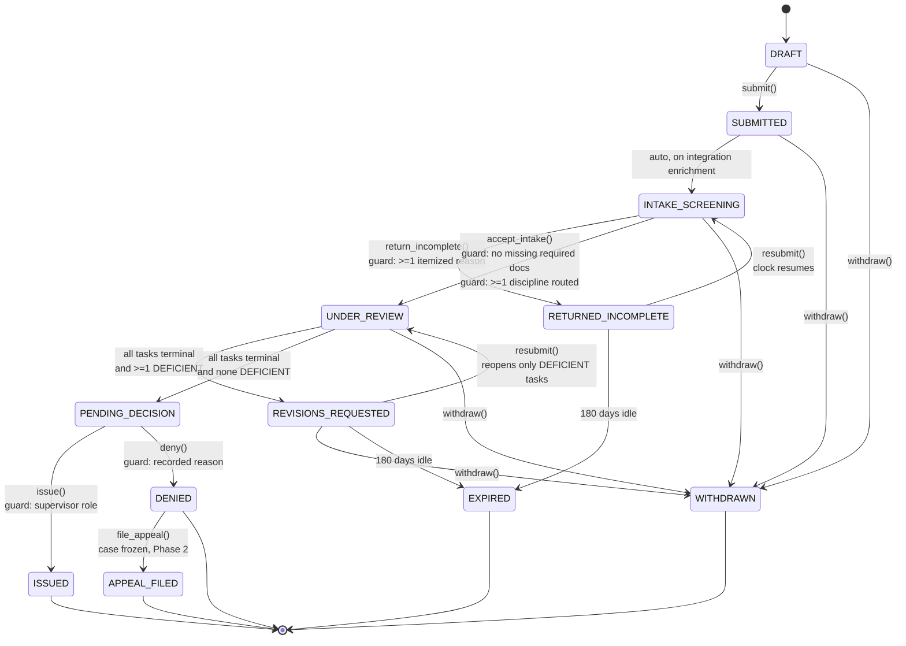
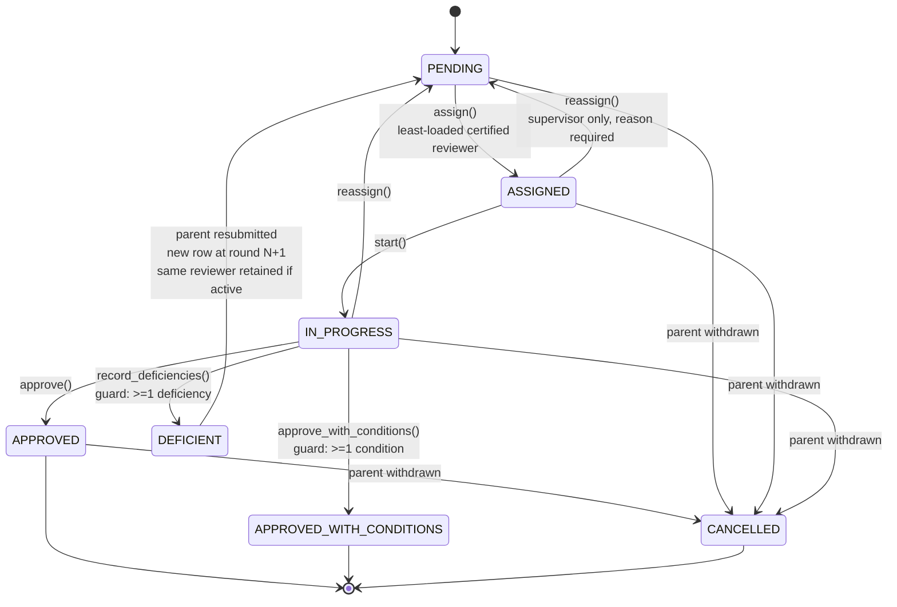
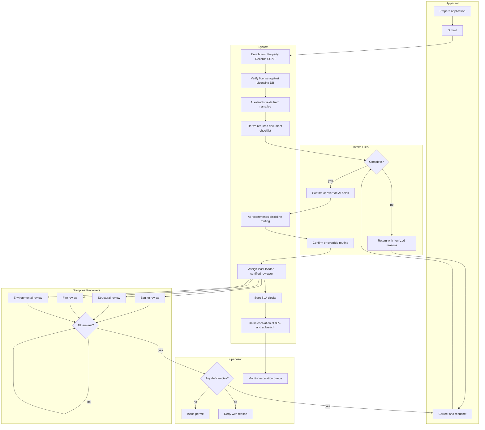
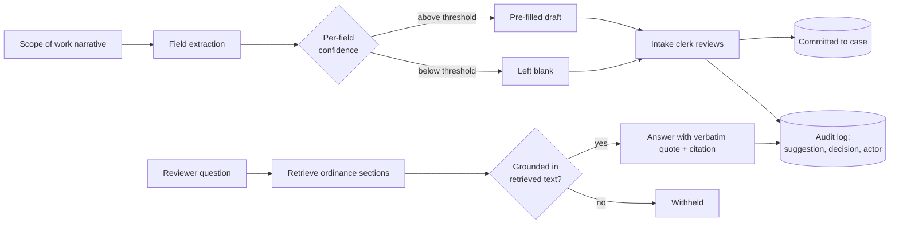

# Process Map

Two views of the same process. The lifecycle diagram is the contract the code implements
in `permitflow/process/states.py`. The swimlane diagram is the version that goes on the
wall in a client workshop.

## 1. Application lifecycle

### State reference

| State | Clock | Who acts next | Notes |
|---|---|---|---|
| DRAFT | not started | applicant | Nothing is committed to the case record yet |
| SUBMITTED | running | system | Transient. Integration enrichment runs here |
| INTAKE_SCREENING | running | intake clerk | Completeness check against the derived checklist |
| RETURNED_INCOMPLETE | **paused** | applicant | Waiting on applicant, so the clock does not run |
| UNDER_REVIEW | running | discipline reviewers | Parallel tasks, one per routed discipline |
| REVISIONS_REQUESTED | **paused** | applicant | Waiting on applicant |
| PENDING_DECISION | running | supervisor | Every discipline has signed off |
| ISSUED / DENIED / WITHDRAWN / EXPIRED | stopped | none | Terminal |
| APPEAL_FILED | stopped | appeals board | Frozen. Phase 1 records only |

The paused states are the whole reason the SLA math is non-trivial. A case that sits for
three weeks waiting on an applicant has not consumed three weeks of the department's
20-day allowance, and reporting that it has would understate the department's actual
performance. See `docs/03-data-model.md` for how the pause intervals are stored.

## 2. Review task lifecycle

Each routed discipline gets its own task. Tasks are independent until every one of them
reaches a terminal outcome, at which point the parent application transitions.

`DEFICIENT` is terminal for the round but not for the task. FR-12 requires that a
resubmission reopens only the disciplines that recorded deficiencies. A structural
reviewer who already approved does not review the case a second time because the fire
reviewer found a problem.

## 3. Swimlane view

## 4. Where the AI sits

Worth calling out separately, because the first question a client asks about an AI feature
is what happens when it is wrong.

Both paths end at a human and at the audit log. Nothing the model produces moves the case
by itself, which is AI-04. The retrieval path withholds rather than guesses, which is
AI-06.

## 5. Escalation timing

SLA allowances are per permit type and per discipline, held in `sla_policies` rather than
in code so DPS can change them without a release.

```mermaid
gantt
    title Residential permit, 20 business day standard
    dateFormat X
    axisFormat %s

    section Application clock
    Intake screening (3d allowance)      :done, 0, 3
    Under review (14d allowance)         :active, 3, 17
    Pending decision (3d allowance)      :4, 17, 20

    section Escalations
    Warning at 80% of review allowance   :milestone, 14, 0
    Breach of review allowance           :crit, milestone, 17, 0
    Breach of council standard           :crit, milestone, 20, 0
```

Two escalation levels exist because a warning that fires at the same moment as the breach
is useless to a supervisor. The 80% warning is what gives them a chance to reassign.
