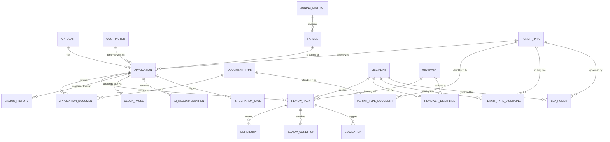

# Data Model

Physical model is PostgreSQL. DDL lives in `sql/001_schema.sql`, reporting views in
`sql/002_views.sql`, reference and sample data in `sql/003_seed.sql`.

## 1. Entity relationship diagram

`AUDIT_LOG` and `HOLIDAY` are intentionally not drawn. The audit log references every
entity polymorphically, so drawing it adds twelve lines and no information. The holiday
calendar is a standalone lookup with no foreign keys.

## 2. Design decisions worth defending

### Review tasks are rows, not columns

The obvious shortcut is four boolean columns on `application`: `zoning_approved`,
`structural_approved`, and so on. It does not survive contact with the requirements.
FR-09 needs an assignee per discipline, FR-14 needs an SLA clock per discipline, FR-12
needs a round counter per discipline, and FR-13 needs reassignment history per discipline.
All of that is attributes of the review, so the review is an entity.

It also means adding a fifth discipline is a row in `discipline` plus a row in
`permit_type_discipline`, with no schema change and no release.

### SLA pause intervals are stored, not derived

`clock_pause` records a row every time an application enters a waiting-on-applicant state
and closes it on resumption. Elapsed SLA time is business days between the clock start and
now, minus business days inside closed pause intervals.

The alternative is to reconstruct pauses by walking `status_history` at query time. That
works, and it was the first design. It was replaced because the compliance number in FR-23
is reported to the city council, and a reporting number that depends on replaying an event
log correctly is a number that will eventually be wrong in a way nobody notices. Storing
the interval makes the calculation a subtraction.

### The audit log is append only at the database level

NFR-04 asks for immutability. Application-level immutability is a convention that the next
developer breaks. A rule that rejects UPDATE and DELETE on `audit_log` cannot be broken by
application code at all, which is what FR-21 actually asks for.

### Round numbers on review tasks

FR-12 requires that a resubmission reopens only deficient disciplines. `review_task.round`
plus a unique constraint on `(application_id, discipline_code, round)` makes each review
cycle its own row. History is preserved, the current task is the highest round, and the
"which disciplines already approved" question is a query rather than a judgment call.

### Denormalized status on application

`application.status` duplicates the latest row in `status_history`. It is denormalized on
purpose. Every queue query in the system filters on current status, and making them all
join to a correlated subquery over history to find it would be slow and unreadable. The
transition path writes both in one transaction, and a test asserts they never disagree.

## 3. Key tables

### application

| Column | Type | Notes |
|---|---|---|
| id | uuid PK | |
| application_number | text unique | Human-facing, `BLD-2026-00147` |
| applicant_id | uuid FK | |
| contractor_id | uuid FK null | Null for owner-occupant work |
| parcel_id | uuid FK | |
| permit_type_code | text FK | |
| status | text | Constrained to the lifecycle states |
| scope_narrative | text | Free text. Input to AI-01 |
| declared_valuation | numeric(12,2) | |
| square_feet | integer null | |
| occupancy_class | text null | |
| submitted_at | timestamptz null | SLA clock start |
| intake_completed_at | timestamptz null | |
| decided_at | timestamptz null | |
| status_since | timestamptz | Drives time-in-state reporting |

### review_task

| Column | Type | Notes |
|---|---|---|
| id | uuid PK | |
| application_id | uuid FK | |
| discipline_code | text FK | |
| round | integer | 1 on first routing, increments on reopen |
| reviewer_id | uuid FK null | Null while PENDING |
| status | text | Task lifecycle state |
| assigned_at, started_at, completed_at | timestamptz null | |
| sla_due_at | timestamptz null | Computed from `sla_policy` at assignment |

Unique on `(application_id, discipline_code, round)`.

### clock_pause

| Column | Type | Notes |
|---|---|---|
| id | uuid PK | |
| application_id | uuid FK | |
| paused_at | timestamptz | |
| resumed_at | timestamptz null | Null means currently paused |
| reason | text | The state that caused the pause |

Partial unique index on `application_id WHERE resumed_at IS NULL`, so an application
cannot be paused twice at once.

### audit_log

| Column | Type | Notes |
|---|---|---|
| id | bigserial PK | |
| entity_type | text | `application`, `review_task`, `document`, `integration`, `ai` |
| entity_id | uuid | |
| action | text | |
| actor | text | Username, or `system` |
| occurred_at | timestamptz | |
| before, after | jsonb null | |

UPDATE, DELETE, and TRUNCATE are rejected by triggers that raise
`insufficient_privilege`. TRUNCATE needs its own statement-level guard because it bypasses
row-level triggers entirely.

### ai_recommendation

| Column | Type | Notes |
|---|---|---|
| id | uuid PK | |
| application_id | uuid FK | |
| kind | text | `field_extraction`, `discipline_routing`, `ordinance_answer` |
| model, prompt_version | text | Reproducibility |
| payload | jsonb | The suggestion |
| confidence | numeric(4,3) null | |
| sources | jsonb null | Retrieved ordinance sections for AI-05 |
| accepted | boolean null | Null until a human decides |
| decided_by, decided_at | text, timestamptz null | |

This table is what makes AI-07 satisfiable and what makes the feature auditable a year
later when someone asks why an application was routed to environmental review.

## 4. Reporting views

| View | Answers | Requirement |
|---|---|---|
| `v_application_summary` | One row per application with applicant, parcel, status, days in state, open tasks | Operational |
| `v_sla_status` | Business days elapsed net of pauses, allowance, days remaining, breach flag | FR-14, FR-16 |
| `v_task_sla_status` | The same question one level down, per review task. Read by the escalation sweep | FR-16 |
| `v_reviewer_workload` | Open tasks and oldest task age per reviewer and discipline | FR-24, P4 |
| `v_discipline_bottleneck` | Open work, overdue work, and recent turnaround per discipline | FR-24, P4 |
| `v_cycle_time` | Per application net business days from submission to decision | FR-22 |
| `v_sla_compliance` | Monthly compliance rate by permit type against the council standard | FR-23 |
| `v_open_escalations` | Unacknowledged escalations ordered by time past due | FR-17 |

`v_reviewer_workload` and `v_discipline_bottleneck` answer two different questions that get
confused with each other. The first is who is loaded. The second is where cases sit. A
supervisor deciding whether to move a reviewer needs the second, and one person being busy
is not the same fact as one discipline being the reason cases are late.

Business day arithmetic is a SQL function, `business_days_between(start, end)`, which
counts weekdays in the interval and subtracts matches in `holiday`. The same rule is
implemented in `permitflow/process/sla.py` for the engine. Having one rule in two places
is a real risk, so a test asserts the two implementations agree across a generated set of
date pairs spanning weekends and holidays.
