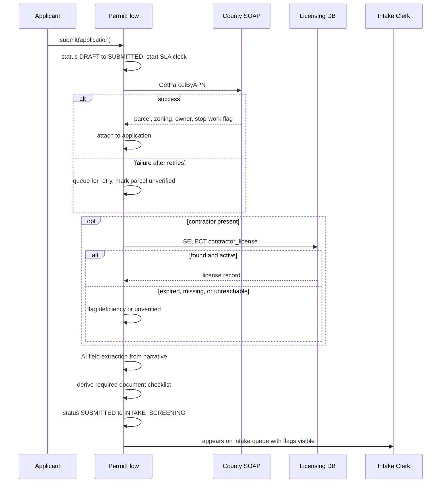

# Integration Specification

Two external dependencies, both outside DPS control, both accessed at intake. Neither has
a modern interface, which is normal for this kind of engagement and is the reason this
document exists.

| # | System | Owner | Protocol | Direction | Trigger |
|---|---|---|---|---|---|
| I1 | County Property Records | Rivermont County Assessor | SOAP 1.1 over HTTP, WSDL published | Read | Application submitted |
| I2 | State Business Licensing | State Dept. of Professional Regulation | Direct database connection, read only | Read | Application submitted, contractor present |

## I1. County Property Records (SOAP)

### Why SOAP

The county runs a records system procured in 2009. The published WSDL is the only
supported interface and the county has no roadmap to replace it. Asking them to build a
REST facade was raised in discovery and declined. This is the ordinary condition of public
sector integration work, so the design accommodates it rather than fighting it.

### Contract

WSDL at `permitflow/integrations/soap_mock/property_records.wsdl`. The mock service in
`permitflow/integrations/soap_mock/server.py` implements it so the whole system runs
locally without the county.

**Operation `GetParcelByAPN`**

Request:

| Field | Type | Notes |
|---|---|---|
| `APN` | string | Assessor parcel number, format `NN-NNN-NNN` |

Response:

| Field | Type | Notes |
|---|---|---|
| `APN` | string | Echoed |
| `SitusAddress` | string | Street address of the parcel |
| `ZoningCode` | string | Maps to `zoning_district.code` |
| `OwnerName` | string | |
| `Acreage` | decimal | |
| `StopWorkOrder` | boolean | Drives FR-06 |
| `LastAssessedDate` | date | |

Faults: `ParcelNotFound`, `ServiceUnavailable`.

### Failure handling

| Condition | Behavior |
|---|---|
| `ParcelNotFound` | Application accepted. Clerk sees "parcel not verified" and can enter details by hand, which is recorded as a manual override in the audit log |
| `ServiceUnavailable`, timeout, connection error | Retry 3 times with exponential backoff at 1s, 2s, 4s. Then queue for retry and accept the application, per NFR-02 |
| 5 consecutive failures | Circuit opens for 60 seconds. Calls fail fast and queue immediately instead of making every applicant wait through three timeouts |

Timeout is 10 seconds per attempt. The county service has been observed to take up to 6
seconds under load.

### Why it degrades instead of blocking

NFR-02 exists because a county outage should not stop Rivermont from accepting permit
applications. The enrichment is valuable but it is not a precondition for the application
existing. Blocking submission would convert someone else's downtime into a Rivermont
service failure, and the front desk would take the calls.

## I2. State Business Licensing (direct database)

### Why a direct connection

The state exposes no API. Jurisdictions are granted a read only account against a replica.
In an Appian implementation this is a JDBC data source, which is why the JD names JDBC
alongside REST and SOAP. This project is Python, so the equivalent is a direct DBAPI
connection to a separate database with a read only role. The integration shape is the same
as JDBC in every respect that matters: a connection string, a pool, a read only credential,
hand-written SQL against a schema you do not own and cannot change.

A small Java module using JDBC proper is a possible addition. It is not built yet.

### Contract

Schema `licensing`, table `contractor_license`, read only.

```sql
SELECT license_number,
       business_name,
       license_type,
       status,          -- ACTIVE | EXPIRED | SUSPENDED | REVOKED
       issued_on,
       expires_on,
       disciplinary_action_count
FROM licensing.contractor_license
WHERE license_number = %s;
```

### Rules applied to the result

| Result | Effect on application |
|---|---|
| `ACTIVE` and `expires_on` in the future | Proceed |
| `ACTIVE` but expiring within 30 days | Proceed, warning shown to clerk |
| `EXPIRED` or no row found | Application accepted, flagged as a deficiency at intake screening |
| `SUSPENDED` or `REVOKED` | Application accepted, escalated to supervisor immediately. Phase 1 does not auto-reject, because a revocation that turns out to be a data error should not deny a permit without a human looking |

### Failure handling

Connection failures follow the same retry, backoff, and circuit breaker policy as I1. A
license that could not be verified is recorded as unverified rather than as valid. The
distinction matters: unverified means the check has to be redone, and valid means it
passed. Collapsing the two would let an outage quietly wave through a revoked license.

## Cross-cutting

### Every call is logged

`integration_call` records system, operation, request, response, status, latency, and
attempt number for every call including retries. This exists because the first question in
any integration dispute is whose side failed, and reconstructing that from application
logs after the fact does not work.

### Credentials

Connection details come from environment variables. Nothing is committed. `.env.example`
lists the required names. The mock SOAP service and a local licensing schema are the
defaults so a fresh clone runs with no real credentials at all, which is NFR-06.

### Idempotency

Both integrations are reads, so retries are safe. If Phase 2 adds a write integration to
the county, it will need an idempotency key and this section will need rewriting.

## Sequence at intake


