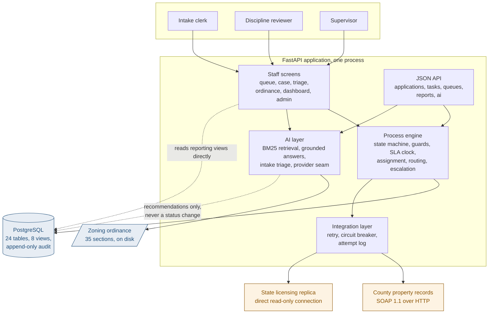
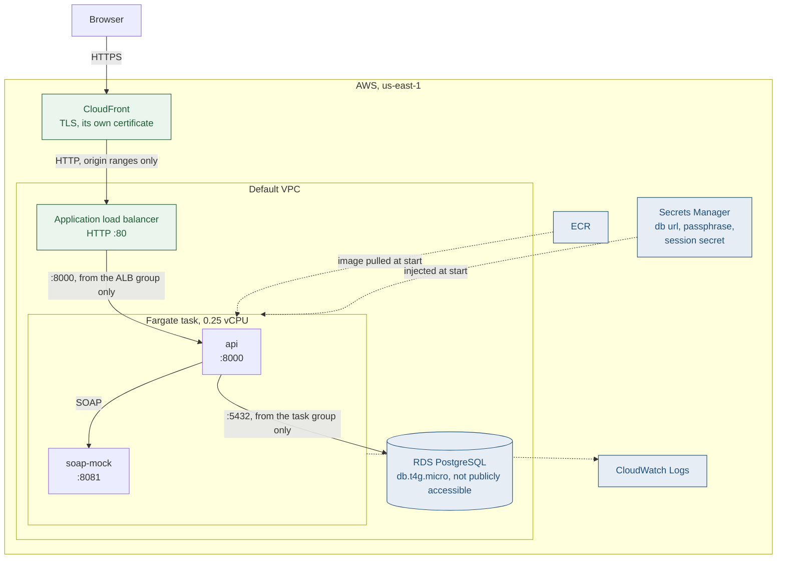

# Architecture

Two views. The first is what the code does. The second is what is deployed. They are drawn
separately because they answer different questions, and a single diagram that tries to do
both ends up showing neither clearly.

Both are Mermaid, so they are text in the repository and GitHub renders them. A picture that
lives as a PNG somewhere goes out of date the first time somebody changes the thing it
describes, and nobody notices.

## 1. The application

Three things in that picture are worth stating out loud.

**The engine is the only thing that moves a case.** Both the screens and the API call it, and
neither writes a status column. Every transition is checked against the state machine and
the actor's role before it happens.

**The AI layer has no path that changes a status.** It writes recommendations and reads the
corpus. A named human accepts or overrides, and that decision is what moves anything.

**The screens read the reporting views directly** for anything they only display. That is the
dotted line on the right. It is deliberate: the compliance number goes to city council, and
recomputing it in Python next to the SQL that already computes it is how two versions of one
number start to disagree.

## 2. The deployment

Each hop accepts traffic only from the hop above it, enforced by security groups and not
by convention:

| Hop | Accepts from |
|---|---|
| CloudFront | the internet, HTTPS only |
| Load balancer | CloudFront's published origin ranges, and nothing else |
| Fargate task | the load balancer's security group |
| Database | the task's security group, with no CIDR rule at all |

The last row is the one worth checking on the console. There is no address on the internet
that can open a connection to the database, because no address appears in its rules.

## 3. What is not in either picture

**`licensing-verifier/`, the Spring service, is not in the request path.** It holds the same
verification rules over a JDBC datasource, it has its own tests, and CI runs them. Nothing
calls it. The seam it would plug into exists (`LicensingBackend` in
`permitflow/integrations/licensing.py`) and has one implementation, the direct connection
the application uses today.

It is drawn nowhere above because drawing it would say something untrue about how a request
flows. Wiring it in means an HTTP backend behind that seam, a parity test driving both
implementations over the same replica rows, and a third container in the task definition.

**The applicant portal.** Applicants are external and have no screen here. Phase 1 is intake
through issuance for department staff, and `docs/01-requirements.md` says so.

**Inspections, fees, certificates of occupancy, appeals hearings.** Out of scope, listed as
such in the requirements, and not started.
